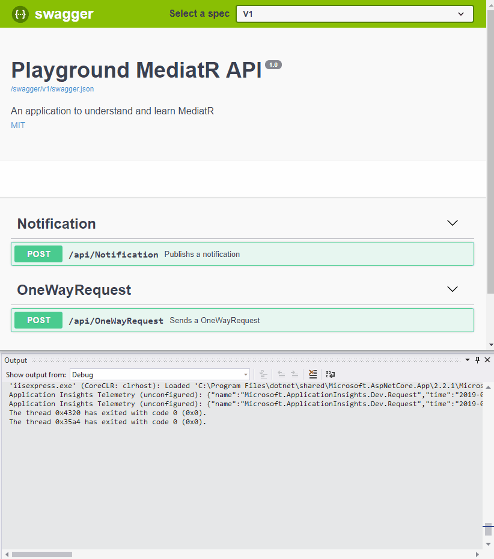
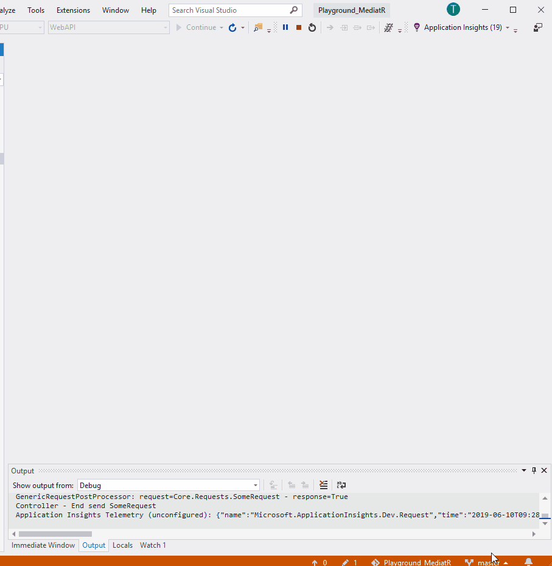

# MediatR with .Net 5

This is an application to learn and understand MediatR, the most popular [CQRS](https://martinfowler.com/bliki/CQRS.html) library for .Net.

From REST Controller Actions are requests send with MediatR and notifications are received by received from handlers in the Domain.
A MediatR pipelinebehavior is used to track the elapsed time of a request

## Requirements
* [Visual Studio 2019](https://visualstudio.microsoft.com/downloads/)
* [.Net 5](https://dotnet.microsoft.com/download)

## Used libraries
* [MediatR](https://github.com/jbogard/MediatR) 
* [Application Insights](https://docs.microsoft.com/en-us/azure/azure-monitor/app/api-custom-events-metrics)
* [Swagger via Swashbuckle](https://github.com/domaindrivendev/Swashbuckle) 

This Swagger REST project is based on a template from Microsoft, see https://github.com/microsoft/aspnet-api-versioning/tree/master/samples/aspnetcore/SwaggerSample

## Containing Projects
| Projectname     | Description    |
|:--------------- |:------ |
| WebAPI          | WebAPI project with a Swagger frontend to trigger messages and notification via MediatR |
| Core            | Library project contains MediatR requests and notification models and behaviors   |
| Domain          | Library project receives notifications and requests  |

## Live Demo

### Trigger Requests

On the top you see the swagger UI which triggers some requests and on the bottom is the output view of VS 2019 with log messages of each methode call.

## See Elapsed / Execution Time of a Request in Secconds

A request is tracked through a pipeline behavior as a custom event with application insights. The property ExecutionTime shows the duration of a request in seconds.

